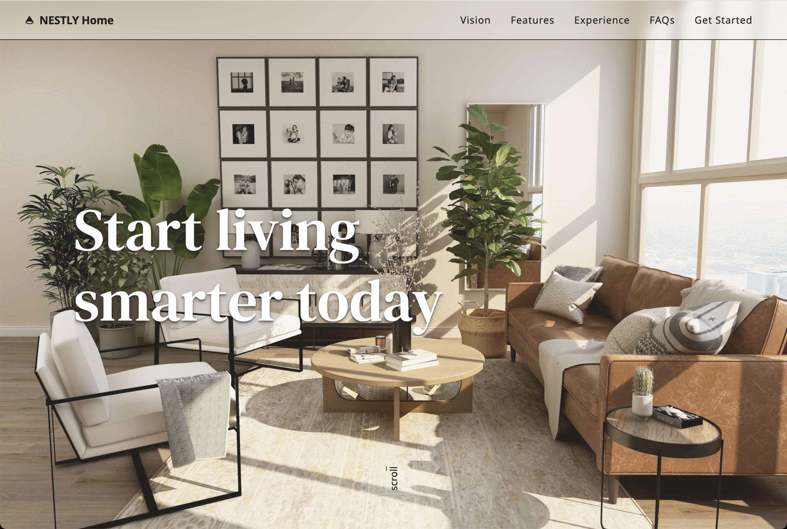

# NESTLY Home — Smart Home Landing Page

A modern and minimal smart home landing page built with [Vue 3](https://vuejs.org/), [Vite](https://vitejs.dev/), and [GSAP](https://greensock.com/gsap/).
Designed to deliver a calm, futuristic experience with smooth animations and responsive layout.

This project was built as part of my personal portfolio.



## 🔗 Demo

https://nestly-home.vercel.app/

## 🚀 Features

- 🌗 Full-screen hero section with smooth opening animation
- 🎯 Scroll-triggered animations using GSAP + ScrollTrigger
- 📱 Responsive layout
- 💡 Seamless timeline interactions that feel natural to use
- ⚡️ Fast performance via Vite
- 🎨 Tailwind CSS for utility-first styling

## 🛠 Tech Stack

- Vue 3 + Vite
- Tailwind CSS
- GSAP / ScrollTrigger
- Heroicons
- Unsplash (images)
- Lenis (smooth scrolling)

## 📦 Getting Started

```bash
git clone https://github.com/yourname/nestly.git
cd nestly
npm install
npm run dev
```
